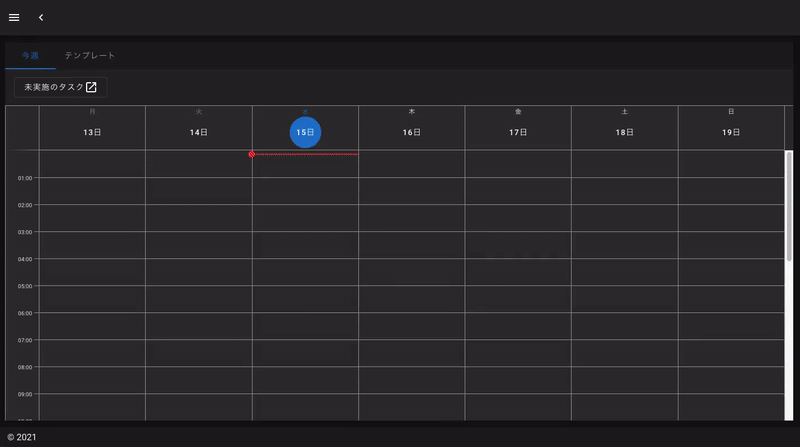
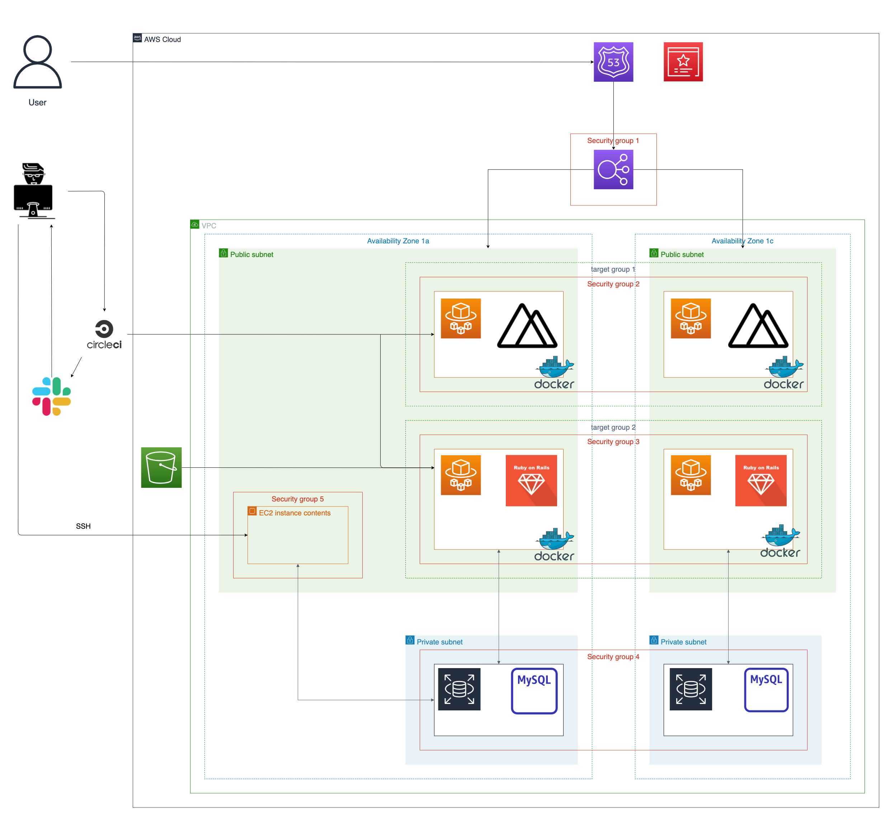
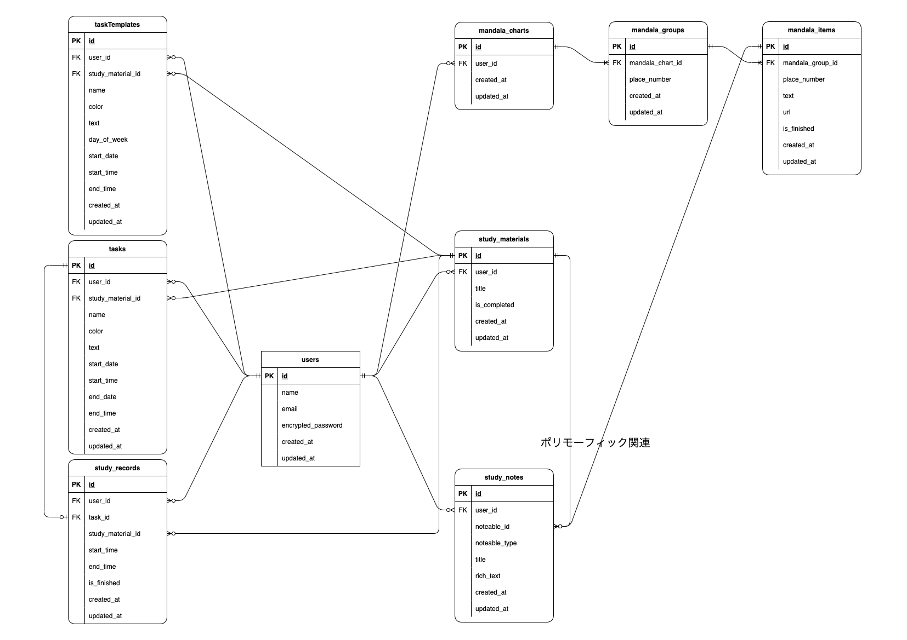

# Study Management App

## 概要
継続的な学習をサポートする web アプリケーションです。 
使いやすさにこだわって作成しました（詳細は「工夫した点」セクションをご参照ください） 
ゲストログインから簡単にアプリをお試しください！ 
URL：https://study-management-app.com  
サービスのイメージ

   

## AWS構成図
 

   

## ER図
 

   

## 使用した技術
| フロントエンド  | バックエンド  | インフラ |
| :--- | :--- | :--- |
| Vue 2.6.13 | Ruby 2.7.2 | Docker |
| Nuxt.js 2.15.6 | Rails 6.1.3 | CircleCI |
| Vuetify 2.5.3 | RSpec / Rubocop | AWS |
 

## 工夫した点
* スケジュール機能  
・スケジュールのテンプレートを作成することで、学習スケジュールの管理を簡単にしたこと 
  （長期スパンの学習予定を立てたが一時的に〇〇の週だけは別の学習スケジュールにしたいなど、柔軟に学習予定を変えるためには、スケジュール用のテンプレートが必須だった。）  
・スケジュールの特定の時間をクリックすることで、学習予定作成フォームに自動で時間が入力されるようにしたこと  
・未実施の学習予定を一覧表示することで、学習の進捗状況がひと目でわかること  
・学習予定のドラッグアップデートに対応したこと  
* UI/UX  
・レスポンシブデザインに対応し、様々なデバイスで使用できるようにしたこと 
  （デバイスのサイズによってデザインが崩れないように専用のデザインを用意した）  
・アプリのデザインをダークモードで統一したこと 
  （ダークモードに対応していない Editor.js の css を調整した）  
・ツールが画面に収まらない場合はスクロール機能が有効化され、レイアウトが崩れるのを防いだこと  
* インフラ  
・CircleCI, Amazon ECR, AWS Fargate, Slack を連携し、デプロイの工数を削減して開発効率を向上させたこと   

## 【機能一覧】
| スケジュール |
| :--- |
* 学習予定の CRUD
* 学習予定のドラッグアップデート
* 学習時間の記録、更新
* 学習予定のブラックアウト（学習時間が記録された予定が対象）
* 学習時間が記録されていない予定の一覧表時
  

| スケジュールテンプレート |
| :--- |
* 学習予定のテンプレートの CRUD
* 学習予定をスケジュールへ反映
* ドラッグアップデート
  

| タイムライン |
| :--- |
* 当日の学習予定の一覧表示
* 学習時間の記録、更新
* 学習予定のブラックアウト（学習時間が記録された予定が対象）
  

| 教材 |
| :--- |
* 教材の追加（画像は楽天 books から取得）
* 教材の一覧表示
  

| マンダラチャート |
| :--- |
* アイテムの CRUD（アイテム：マンダラチャート 9✕9 の 1マスのコンテンツ）
* 外部サイト遷移（コンテンツに追加した URL）
* アイコンの表示（URLの登録,項目の達成で各アイコンをコンテンツに表示）
  

| ノート |
| :--- |
* ノートの CRUD
* 閲覧モード,編集モードの切り替え
* 画像（active storage を用いたダイレクトアップロード）
* チェックリスト
* リスト
* ヘッダー
  
